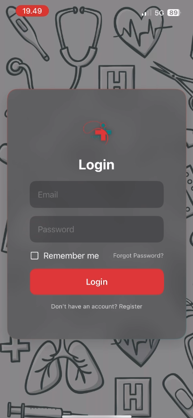
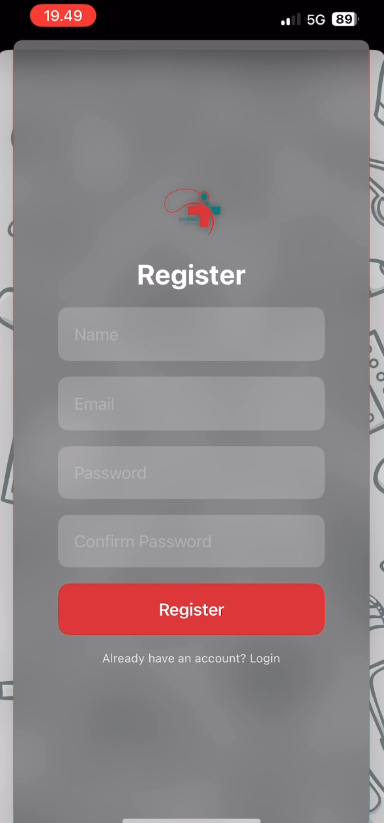
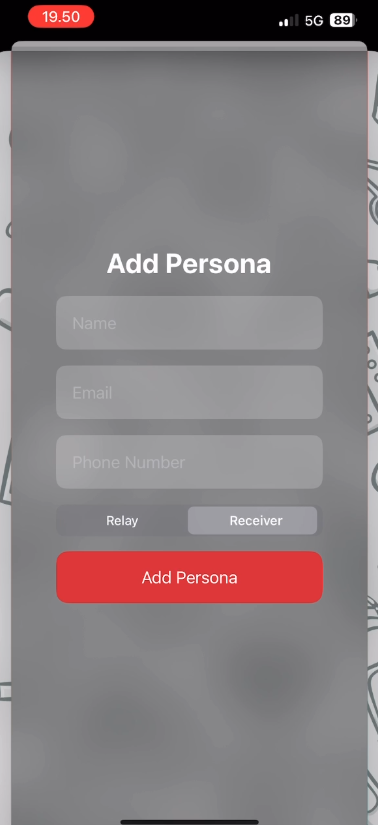
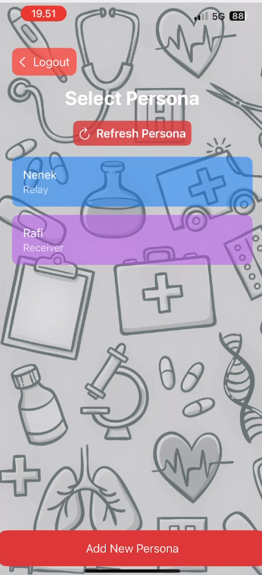
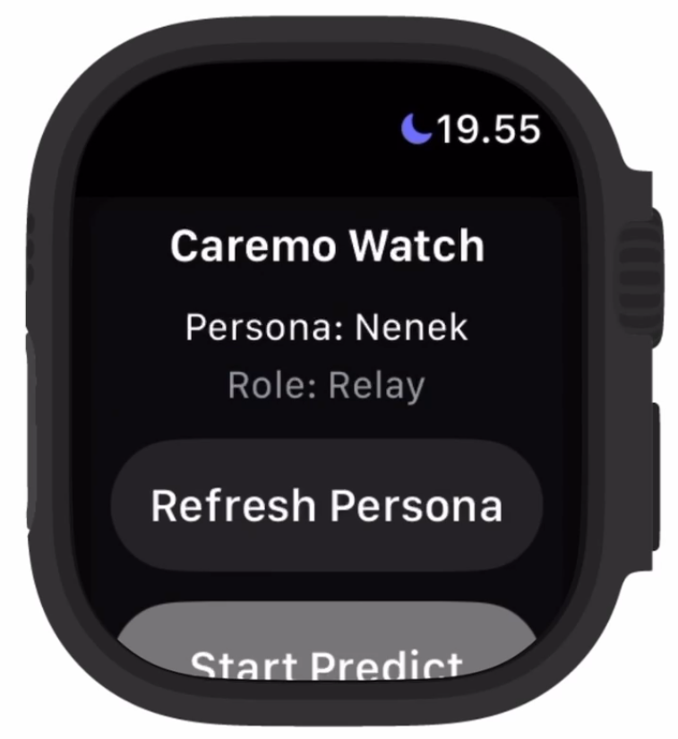

# Caremo: AI-Assisted Remote Monitoring Cardiovascular Health Activities for Indonesian Elders

Caremo is an integrated iOS and watchOS solution enabling real-time cardiovascular health monitoring for Indonesian elders using AI-assisted predictions and alerts.

## UI

### Login


### Signup


### Add Persona


### Persona List


### Watch OS


### Whatsapp


## 🛠️ Tech Stacks

### 📱 iOS App

- **SwiftUI**: Declarative UI framework for building interfaces across Apple devices.
- **Combine**: Framework for handling asynchronous events and reactive programming.
- **URLSession & Codable**: Native networking and JSON parsing for API integration.
- **HealthKit**: Securely access and store health data such as heart rate, ECG, and blood oxygen.
- **CoreLocation**: Retrieve device geolocation to enrich health context and emergency responses.
- **UserDefaults**: Persist lightweight user data such as persona selections and tokens locally.

### ⌚ watchOS App

- **SwiftUI**: Optimized interfaces for Apple Watch screens and interactions.
- **WatchConnectivity**: Seamless communication and data sync between iPhone and Apple Watch apps.
- **CoreLocation**: Retrieve Watch geolocation when available for critical condition alerts.
- **Timer**: Schedule periodic health data predictions to backend.
- **NotificationCenter**: Intra-app updates for persona refreshes.

### ⚙️ Installation

**Clone the repository**

```bash
git clone https://github.com/your-org/caremo-ios.git
cd caremo-ios
